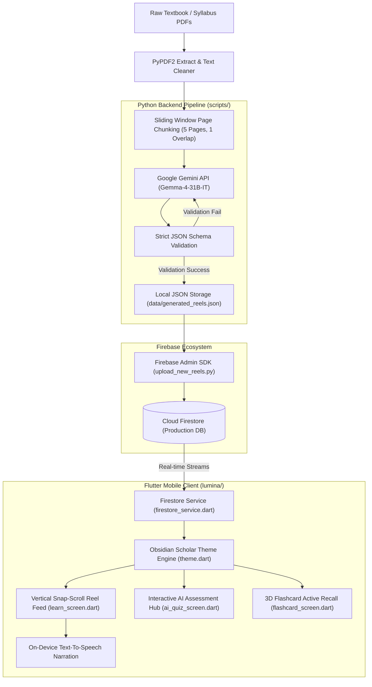
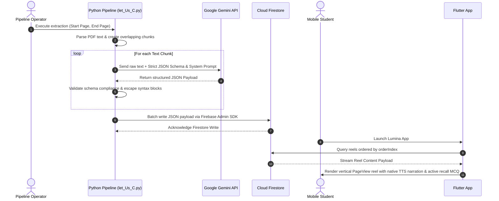

# Lumina: Adaptive Cognitive Micro-Learning Engine (Android) ⚡️

[](https://flutter.dev)
[](https://developer.android.com)
[](https://dart.dev)
[](https://python.org)
[](https://ai.google.dev)
[](https://firebase.google.com)
[](LICENSE)
[](https://github.com/soumen888/Lumina/blob/main/CONTRIBUTING.md)
[](https://github.com/soumen888/Lumina/issues)

> **The idea is simple:**
> 1. Upload a textbook, syllabus, notes, or any study material.
> 2. AI breaks it down into reel-sized learning cards.
> 3. Instead of doomscrolling, you scroll through concepts, formulas, stories, examples, and quick revisions.
>
> **The goal:** Make learning as engaging as social media — while actually helping you remember what you study.

Lumina is an enterprise-grade, cognitive learning platform that transforms dense, static academic literature (textbooks, research PDFs, exam syllabi) into high-engagement, vertical micro-learning feeds ("Reels"), interactive active-recall flashcards, and adaptive AI-generated assessment suites.

By marrying the psychological hooks of short-form social media feeds (TikTok/Instagram Reels) with rigorous cognitive science principles (spaced repetition, micro-chunking, active recall), Lumina eliminates study friction and mental fatigue for students preparing for competitive technical examinations.

---

## 🤝 Contributing

This project is open to contributions. Whether you're into Flutter, Firebase, AI prompting, learning science, or just want to fix a typo — there's a place for you here.

**Current areas needing help most:**
- 📱 Flutter UI polish & animations
- 🧠 Spaced repetition (SM-2) engine implementation
- 🤖 AI prompt engineering for better reel quality
- 🐍 Stateless backend pipeline architecture
- 📖 Documentation & onboarding improvements

👉 **[Read CONTRIBUTING.md to get started](CONTRIBUTING.md)** · [Open an Issue](https://github.com/soumen888/Lumina/issues/new/choose)

---

## 📑 Table of Contents

- [Contributing](#-contributing)
- [1. Executive Overview \& Problem Statement](#1-executive-overview--problem-statement)
- [2. System Architecture](#2-system-architecture)
  - [2.1 High-Level Data Pipeline Architecture](#21-high-level-data-pipeline-architecture)
  - [2.2 Sequence Diagram: PDF to Micro-Learning Reel](#22-sequence-diagram-pdf-to-micro-learning-reel)
- [3. Backend AI Extraction Pipeline (`/scripts`)](#3-backend-ai-extraction-pipeline-scripts)
  - [3.1 PDF Parsing \& Chunking Strategy](#31-pdf-parsing--chunking-strategy)
  - [3.2 LLM Structuring \& Gemini Engine Integration](#32-llm-structuring--gemini-engine-integration)
  - [3.3 Resiliency, State Persistence \& Fault Tolerance](#33-resiliency-state-persistence--fault-tolerance)
  - [3.4 Firestore Deployment \& Admin SDK Pipeline](#34-firestore-deployment--admin-sdk-pipeline)
  - [3.5 Maintenance \& Diagnostic Utility Suite (`/scripts/utils`)](#35-maintenance--diagnostic-utility-suite-scriptsutils)
- [4. Frontend Rendering Engine (`/lumina`)](#4-frontend-rendering-engine-lumina)
  - [4.1 "Obsidian Scholar" Design System (`theme.dart`)](#41-obsidian-scholar-design-system-themedart)
  - [4.2 Custom Snap-Scrolling Reel Engine (`learn_screen.dart`)](#42-custom-snap-scrolling-reel-engine-learn_screendart)
  - [4.3 Dynamic Assessment \& MCQ Module (`ai_quiz_screen.dart` / `quiz_hub_screen.dart`)](#43-dynamic-assessment--mcq-module-ai_quiz_screendart--quiz_hub_screendart)
  - [4.4 Active Recall Revision Engine (`flashcard_screen.dart` / `saved_screen.dart`)](#44-active-recall-revision-engine-flashcard_screendart--saved_screendart)
  - [4.5 Zero-Bandwidth Audio Narration (Native TTS)](#45-zero-bandwidth-audio-narration-native-tts)
- [5. Rapid UI/UX Prototyping (`/UI`)](#5-rapid-uiux-prototyping-ui)
- [6. Data Schemas \& Models](#6-data-schemas--models)
  - [6.1 Reel Content JSON Schema](#61-reel-content-json-schema)
  - [6.2 MCQ Question JSON Schema](#62-mcq-question-json-schema)
- [7. Complete Directory Hierarchy](#7-complete-directory-hierarchy)
- [8. Installation, Environment Setup \& Quick Start](#8-installation-environment-setup--quick-start)
  - [8.1 Prerequisites](#81-prerequisites)
  - [8.2 Python Backend Pipeline Setup](#82-python-backend-pipeline-setup)
  - [8.3 Flutter Mobile Application Setup](#83-flutter-mobile-application-setup)
- [9. Security, Secrets Management \& Privacy](#9-security-secrets-management--privacy)
- [10. Technical Performance Benchmarks](#10-technical-performance-benchmarks)
- [11. Future Architectural Roadmap](#11-future-architectural-roadmap)

---

## 1. Executive Overview & Problem Statement

Traditional academic preparation relies heavily on monolithic textual mediums (500+ page PDFs, dense physical textbooks). This approach exhibits significant cognitive friction:
1. **High Activation Energy**: Committing to reading long chapters creates procrastination barriers.
2. **Passive Consumption**: Passive reading yields low memory retention compared to active recall.
3. **Monolithic Information Formatting**: Textbooks group fundamental principles, syntax examples, and practice questions into broad paragraphs rather than isolating atomic concepts.

Lumina addresses these challenges by decomposing complex technical curricula into atomic cognitive units (30-60 second micro-reels). Each reel enforces a tri-fold learning loop:
- **Atomic Concept Explanation**: A concise, crystal-clear breakdown of a single principle.
- **Syntactic Code / Concrete Example**: Immediate real-world application or code snippet.
- **Instant Mastery Check**: A single active-recall question embedded directly in the reel context to validate comprehension before scrolling.

---

## 2. System Architecture

Lumina utilizes a **decoupled asynchronous architecture**. Heavy document extraction, natural language understanding, structural schema validation, and database seeding occur offline in the Python backend pipeline. The Flutter mobile application operates as a lightweight, hardware-accelerated rendering engine consuming real-time Firebase Firestore streams.

### 2.1 High-Level Data Pipeline Architecture



### 2.2 Sequence Diagram: PDF to Micro-Learning Reel



---

## 3. Backend AI Extraction Pipeline (`/scripts`)

The backend pipeline processes raw educational assets and translates them into structured JSON arrays optimized for instant mobile rendering.

### 3.1 PDF Parsing & Chunking Strategy

Implemented in `extract_raw_text.py` and core ingestion scripts (`let_Us_C.py`, `arihant_mcqs.py`):
- **Page Extraction**: Utilizes `PyPDF2` to read exact page ranges corresponding to specific textbook units.
- **Sliding-Window Chunking**: Splits large texts into overlapping blocks (`chunk_size = 5` pages with `overlap = 1` page). Overlapping prevents splitting concepts across chunk boundaries.
- **Pre-cleaning**: Strips header/footer artifacts, publisher page numbers, and invalid ASCII characters.

### 3.2 LLM Structuring & Gemini Engine Integration

The pipeline interfaces with Google's Gemini API (utilizing `models/gemma-4-31b-it` / Gemini Flash models) to perform zero-shot structural extraction.

#### System Instruction Enforcement:
The LLM is prompted with strict structural constraints:
1. **JSON Only**: Markdown code fencing (` ```json `) and conversational intro/outro text are programmatically prohibited.
2. **Atomic Granularity**: Every single rule, keyword, syntax constraint, or formula found in the input block must yield a distinct reel.
3. **Schema Compliance**: The response must conform exactly to `JSON_SCHEMA`.

### 3.3 Resiliency, State Persistence & Fault Tolerance

- **Chunk Resume Mechanism**: Scripts track processed chunks using `START_CHUNK` offsets. If an API call fails or hits rate limits, execution resumes without re-processing earlier chunks or duplicating Firestore entries.
- **Exponential Backoff**: Automated retries handle API rate limits (`429 Too Many Requests`).
- **Data Safety**: Output JSON files are cached locally in `data/` before triggering database synchronization.

### 3.4 Firestore Deployment & Admin SDK Pipeline

Scripts `upload_new_reels.py`, `MCQ_Upload.py`, and `Backup Upload.py` handle cloud deployment:
- Authenticates securely via `serviceAccountKey.json` using `firebase_admin.credentials.Certificate`.
- Executes Firestore **batch writes** (grouping up to 500 documents per batch) to ensure atomic database updates and minimize network overhead.

### 3.5 Maintenance & Diagnostic Utility Suite (`/scripts/utils`)

Located in `scripts/utils/`, this toolkit handles database maintenance:
- **`cleanup_duplicate_reels.py`**: Scans Firestore collections for duplicate concept titles or identical module IDs and purges redundant documents.
- **`diagnose_reels.py`**: Audits database integrity, flagging missing fields, broken JSON types, or unindexed ordering fields.
- **`fix_unit10_in_place.py` / `fix_unit10_firebase.py`**: Rapidly patches specific fields (such as updating unit titles or ordering indices) directly in local files or live Firestore instances without re-running expensive LLM API calls.
- **`clear_firestore.py`**: Emergency wipe script to reset test collections.
- **`download_collection.py`**: Downloads live Firestore collections into local JSON files for offline snapshot creation.

---

## 4. Frontend Rendering Engine (`/lumina`)

The frontend application is built with **Flutter (Dart)**, targeted at high-performance 60FPS/120FPS cross-platform mobile rendering.

### 4.1 "Obsidian Scholar" Design System (`theme.dart`)

Lumina features a custom dark-mode aesthetic termed **"Obsidian Scholar"**:
- **Palette**: Deep Obsidian background (`#0D0E15`), Electric Indigo primary (`#6366F1`), Neon Cyan secondary (`#06B6D4`), and Glassmorphic Surface overlays (`rgba(255, 255, 255, 0.05)`).
- **Glassmorphism**: Hardware-accelerated backdrop blur filters (`BackdropFilter` with `ImageFilter.blur(sigmaX: 10, sigmaY: 10)`) paired with ultra-thin semi-transparent borders.
- **Typography Scale**: Clean Google Fonts pairing using **Sora** for headlines and structural titles, and **Inter** for body text and interactive elements. Code blocks utilize monospace fonts with syntax highlighting.

### 4.2 Custom Snap-Scrolling Reel Engine (`learn_screen.dart`)

The flagship learning interface mimics short-form video feeds:
- **Navigation Physics**: Built on a vertical Flutter `PageView.builder` combined with `ClampingScrollPhysics` to deliver responsive, snap-to-page scroll mechanics.
- **Lazy Loading**: `PageView.builder` ensures memory overhead remains constant regardless of whether the user scrolls through 10 or 1,000 reels.
- **Interactive Layers**:
  - **Concept Card**: Displays module tags, unit titles, and high-density conceptual breakdowns.
  - **Code Sandbox / Examples**: Formatted code boxes with syntax highlighting and inline explanations.
  - **In-Feed Mastery Check**: Expandable active recall question widget allowing immediate self-testing before scrolling.

### 4.3 Dynamic Assessment & MCQ Module (`ai_quiz_screen.dart` / `quiz_hub_screen.dart`)

- **Quiz Hub**: Hierarchical curriculum browser (`computer_subjects_screen.dart`, `units_screen.dart`) organizing quizzes by subjects and granular units.
- **Assessment Engine**: Fetches objective MCQ objects from Firestore, handling real-time answer selection, instant visual feedback (green/red glassmorphic state transitions), countdown timer pressure mechanics, and overall score aggregation.

### 4.4 Active Recall Revision Engine (`flashcard_screen.dart` / `saved_screen.dart`)

- **Flashcard Engine**: Renders 3D-flipping cards powered by Flutter matrix transformations (`Transform`). Front of card shows concept prompts; rear shows structured answers.
- **Saved Screen**: Bookmark manager allowing users to save high-yield reels or flagged questions for focused revision.

### 4.5 Zero-Bandwidth Audio Narration (Native TTS)

To eliminate the storage and bandwidth overhead of streaming megabytes of pre-recorded MP3 files:
- Lumina integrates on-device **Text-To-Speech (TTS)** engines (`flutter_tts`).
- Narrates reel text in real-time on-device, offering hands-free audio-visual learning with zero cloud bandwidth usage.

---

## 5. Rapid UI/UX Prototyping (`/UI`)

Before Flutter implementation, interfaces are prototyped in raw **HTML5**, **CSS3**, and **Tailwind CSS**. Located in the `/UI` folder:
- **Prototyped Views**: `index.html` (Learn Feed), `quiz.html` (Assessment Suite), `progress.html` (Analytics Dashboard), `saved.html` (Bookmarks).
- **Design Tokens Documented**: Complete color variables, glassmorphic blur classes, and card dimensions are defined in `UI/DESIGN.md`.

---

## 6. Data Schemas & Models

### 6.1 Reel Content JSON Schema

```json
{
  "$schema": "http://json-schema.org/draft-07/schema#",
  "title": "LuminaReelContent",
  "type": "object",
  "properties": {
    "moduleId": {
      "type": "string",
      "description": "Unique identifier for the module (e.g., 'c_prog_unit10_01')"
    },
    "sectionTitle": {
      "type": "string",
      "description": "Curriculum taxonomy header (e.g., 'UNIT 10 • STRUCTURES')"
    },
    "conceptTitle": {
      "type": "string",
      "description": "Name of the atomic concept being explained"
    },
    "coreConcept": {
      "type": "string",
      "description": "Concise, cinematic breakdown of the core concept"
    },
    "orderIndex": {
      "type": "integer",
      "description": "Global sequential ordering index for feed sorting"
    },
    "examples": {
      "type": "array",
      "items": {
        "type": "object",
        "properties": {
          "code": { "type": "string", "description": "Code snippet or syntax example" },
          "explanation": { "type": "string", "description": "Line-by-line breakdown of code" }
        },
        "required": ["code", "explanation"]
      }
    },
    "masteryCheck": {
      "type": "object",
      "properties": {
        "question": { "type": "string" },
        "options": {
          "type": "array",
          "items": { "type": "string" },
          "minItems": 4,
          "maxItems": 4
        },
        "correctIndex": { "type": "integer", "minimum": 0, "maximum": 3 },
        "explanation": { "type": "string" }
      },
      "required": ["question", "options", "correctIndex", "explanation"]
    },
    "flashcard": {
      "type": "object",
      "properties": {
        "front": { "type": "string" },
        "back": { "type": "string" }
      },
      "required": ["front", "back"]
    }
  },
  "required": [
    "moduleId",
    "sectionTitle",
    "conceptTitle",
    "coreConcept",
    "examples",
    "masteryCheck",
    "flashcard"
  ]
}
```

### 6.2 MCQ Question JSON Schema

```json
{
  "$schema": "http://json-schema.org/draft-07/schema#",
  "title": "LuminaMCQQuestion",
  "type": "object",
  "properties": {
    "questionId": { "type": "string" },
    "subject": { "type": "string" },
    "unitTitle": { "type": "string" },
    "question": { "type": "string" },
    "options": {
      "type": "array",
      "items": { "type": "string" },
      "minItems": 4,
      "maxItems": 4
    },
    "correctAnswerIndex": { "type": "integer" },
    "explanation": { "type": "string" },
    "difficulty": { "type": "string", "enum": ["easy", "medium", "hard"] }
  },
  "required": ["questionId", "subject", "unitTitle", "question", "options", "correctAnswerIndex", "explanation"]
}
```

---

## 7. Complete Directory Hierarchy

```text
Lumina-Public/
├── .env.example                     # Environment variables configuration template
├── .gitignore                        # Git exclusion rules for secrets, builds & raw data
├── readme.md                         # Comprehensive technical documentation
├── CONTRIBUTING.md                   # Contributor guide & setup instructions
├── CODE_OF_CONDUCT.md                # Community standards
├── SECURITY.md                       # Credential leak protocol & vulnerability reporting
├── CHANGELOG.md                      # Version history
├── LICENSE                           # Custom Non-Commercial License
├── serviceAccountKey.example.json   # Firebase Admin SDK credentials template
├── .github/                          # GitHub configuration
│   ├── CODEOWNERS                    # Auto-assigns PR reviews to maintainer
│   ├── workflows/
│   │   └── flutter_ci.yml            # CI: flutter analyze + test on every PR
│   ├── ISSUE_TEMPLATE/
│   │   ├── bug_report.md             # Structured bug report template
│   │   └── feature_request.md        # Feature request template
│   └── pull_request_template.md      # PR review checklist
├── data/                             # Sample schemas and public test datasets
│   └── sample_reels.json             # Demo reels payload for offline testing
├── UI/                               # HTML5 / Tailwind CSS rapid prototyping suite
│   ├── README.md                     # Design system overview & how to use prototypes
│   ├── Learn/
│   │   ├── code.html                 # HTML prototype: Learn Feed Screen
│   │   ├── DESIGN.md                 # Obsidian Scholar design tokens
│   │   └── screen.png                # Screenshot preview
│   ├── Quiz/
│   │   ├── code.html                 # HTML prototype: Quiz & Assessment Hub
│   │   ├── DESIGN.md
│   │   └── screen.png
│   ├── Progress/
│   │   ├── code.html                 # HTML prototype: User Mastery Analytics
│   │   ├── DESIGN.md
│   │   └── screen.png
│   └── Saved/
│       ├── code.html                 # HTML prototype: Bookmarked Reels & Revision
│       ├── DESIGN.md
│       └── screen.png
├── scripts/                          # Python backend extraction & AI ingestion pipeline
│   ├── config.yaml                   # ⚙️ Central pipeline config (edit this first!)
│   ├── Extract.py                    # PyPDF2 text extraction engine
│   ├── generate_reels.py             # Gemini AI → structured Reel JSON generator
│   ├── generate_mcqs.py              # Gemini AI → MCQ question generator
│   ├── upload_reels.py               # Batch Reels uploader to Cloud Firestore
│   ├── upload_mcqs.py                # Batch MCQ uploader to Cloud Firestore
│   └── utils/                        # Maintenance, audit & diagnostic scripts
│       ├── cleanup_duplicate_reels.py# Deduplication audit tool for Firestore
│       ├── diagnose_reels.py         # Field index integrity & schema validator
│       ├── fix_unit10_in_place.py    # Local JSON hotfix utility
│       ├── fix_unit10_firebase.py    # Live Firestore document field patcher
│       ├── clear_firestore.py        # Emergency database collection reset utility
│       └── download_collection.py    # Firestore collection downloader & backup tool
└── lumina/                           # Core Flutter Android Mobile Application
    ├── pubspec.yaml                  # Flutter package dependencies & asset definitions
    ├── firebase.json                 # Firebase CLI configuration
    ├── lib/                          # Dart application source code
    │   ├── main.dart                 # App entry point & Firebase initialization
    │   ├── theme.dart                # "Obsidian Scholar" glassmorphic design system
    │   ├── learn_screen.dart         # Vertical snap-scrolling Reel PageView engine
    │   ├── ai_quiz_screen.dart       # Interactive MCQ assessment view
    │   ├── quiz_hub_screen.dart      # Subject & unit taxonomy selection hub
    │   ├── computer_subjects_screen.dart # Computer Science curriculum module
    │   ├── units_screen.dart         # Granular unit drill-down interface
    │   ├── flashcard_screen.dart     # 3D Flip-card active recall revision engine
    │   ├── saved_screen.dart         # Bookmarks & saved concepts manager
    │   ├── progress_screen.dart      # Cognitive mastery analytics dashboard
    │   ├── firebase_options.dart     # Firebase multi-platform auto-generated config
    │   ├── data/
    │   │   └── firestore_service.dart# Firestore data fetching & streaming service
    │   └── models/
    │       ├── reel_content.dart     # Reel Data Model & JSON deserializer
    │       └── quiz_question.dart    # MCQ Data Model & JSON deserializer
    └── android/                      # Native Android build workspace
```

---

## 8. Installation, Environment Setup & Quick Start

### 8.1 Prerequisites

Ensure you have the following installed on your host machine:
- **Flutter SDK**: `v3.19.0` or higher
- **Dart SDK**: `v3.3.0` or higher
- **Python**: `v3.11` or higher
- **Node.js & Firebase CLI**: (Optional, for managing Firebase deployment)

### 8.2 Python Backend Pipeline Setup

1. **Navigate to the scripts directory**:
   ```bash
   cd scripts
   ```

2. **Create and activate a Python virtual environment**:
   ```bash
   python3 -m venv venv
   source venv/bin/activate  # On Windows: venv\Scripts\activate
   ```

3. **Install dependencies**:
   ```bash
   pip install google-generativeai firebase-admin PyPDF2 python-dotenv pyyaml
   ```

4. **Configure Environment Credentials**:
   Copy `.env.example` to `.env` in the root directory and add your keys:
   ```bash
   cp ../.env.example ../.env
   ```
   Edit `.env`:
   ```env
   GEMINI_API_KEY=your_gemini_api_key_here
   FIREBASE_PROJECT_ID=your_firebase_project_id
   GOOGLE_APPLICATION_CREDENTIALS=serviceAccountKey.json
   ```

5. **Configure the Pipeline** (the most important step):
   Open `scripts/config.yaml` and fill in your details:
   ```yaml
   subject: "Your Subject"       # e.g. "Physics", "C Programming"
   pdf_filename: "my_notes.pdf"  # Place the PDF in data/ first
   start_page: 0
   end_page: 50
   unit_title: "UNIT 1 • INTRODUCTION"
   model_name: "gemini-1.5-flash"
   ```
   Every script reads from `config.yaml` automatically — you only need to edit one file.

6. **Run the Extraction Pipeline**:
   ```bash
   python generate_reels.py   # Generate learning reels from your PDF
   python generate_mcqs.py    # Generate MCQ questions from your PDF
   python upload_reels.py     # Upload reels to Firestore
   python upload_mcqs.py      # Upload MCQs to Firestore
   ```

### 8.3 Flutter Mobile Application Setup

1. **Navigate to the Flutter app root**:
   ```bash
   cd lumina
   ```

2. **Fetch Flutter dependencies**:
   ```bash
   flutter pub get
   ```

3. **Configure Firebase**:
   Copy `serviceAccountKey.example.json` to `serviceAccountKey.json` in the root directory if connecting to a custom backend, or run `flutterfire configure` to bind your Firebase project.

4. **Launch Application in Development Mode**:
   ```bash
   # Launch on Chrome Web (Fastest for UI preview)
   flutter run -d chrome

   # Launch on iOS Simulator (Requires Xcode on macOS)
   flutter run -d iPhone

   # Launch on Android Emulator (Requires Android Studio)
   flutter run -d android
   ```

---

## 9. Security, Secrets Management & Privacy

Lumina enforces strict separation between open-source codebase structures and sensitive deployment credentials:
- **Git Exclusion Rules**: `.env`, `serviceAccountKey.json`, `google-services.json`, and generated data files inside `data/` are excluded via `.gitignore`.
- **Public Templates**: The public repository includes `.env.example`, `serviceAccountKey.example.json`, and `data/sample_reels.json`.
- **Key Rotation Protocol**: If credentials are accidentally staged, Firebase Service Account keys must be revoked in the Firebase Console and Gemini API keys rotated in Google AI Studio immediately.

> See **[SECURITY.md](SECURITY.md)** for the full step-by-step credential leak response protocol and vulnerability reporting process.

---

## 10. Technical Performance Benchmarks

| Metric | Target / Benchmark | Implementation Strategy |
| :--- | :--- | :--- |
| **Reel Frame Rate** | 60 - 120 FPS | `PageView.builder` lazy-instantiation & hardware acceleration |
| **Audio Memory Footprint** | ~0 MB | On-Device Native TTS engine (`flutter_tts`) vs streaming MP3s |
| **Firestore Query Speed** | < 120 ms | Field indexing on `orderIndex` and `moduleId` |
| **Batch Database Writes** | 500 docs / batch | `firebase_admin.firestore.batch()` atomic transactions |
| **UI Blur Rendering** | < 2 ms render latency | Skia / Impeller hardware-accelerated `BackdropFilter` |

---

## 11. Future Architectural Roadmap

- [ ] **Cloud Function Microservices**: Migrate Python ingestion scripts to automated Google Cloud Functions triggered by PDF uploads to Cloud Storage.
- [ ] **Spaced Repetition Engine (SM-2 Algorithm)**: Implement SuperMemo-2 spaced-repetition scheduling for the active-recall flashcard module to calculate personalized review intervals.
- [ ] **Offline Cache & Hive Storage**: Integrate `Hive` / `Isar` local NoSQL databases in Flutter to allow full reel browsing and quiz taking without an active internet connection.
- [ ] **Multi-Model LLM Fallback**: Implement automatic failover logic switching between Gemini 1.5 Flash, Gemma 4 31B, and Claude 3.5 Sonnet if primary API limits are exceeded.

---

## 12. License

This project is licensed under a **Custom Source-Available & Non-Commercial License**.

- **Allowed**: Viewing, inspecting, and studying the code for personal, educational, and research purposes.
- **Prohibited**: Commercial use, resale, redistribution, or hosting as a commercial service/SaaS without prior explicit written permission from the author.

See the full terms in the [LICENSE](LICENSE) file.

---

<p center="align">
  <b>Lumina Learning System</b> • Developed for High-Yield Competitive Technical Education.
</p>
